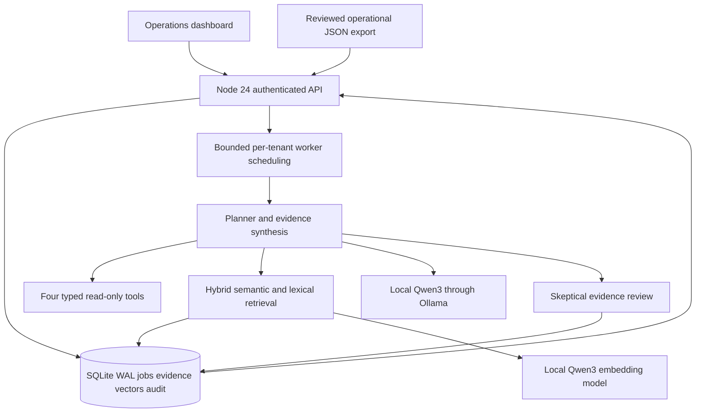
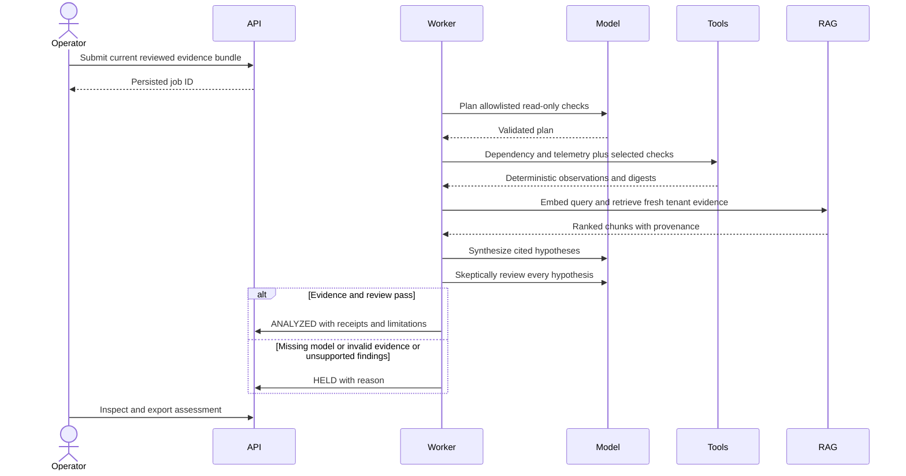
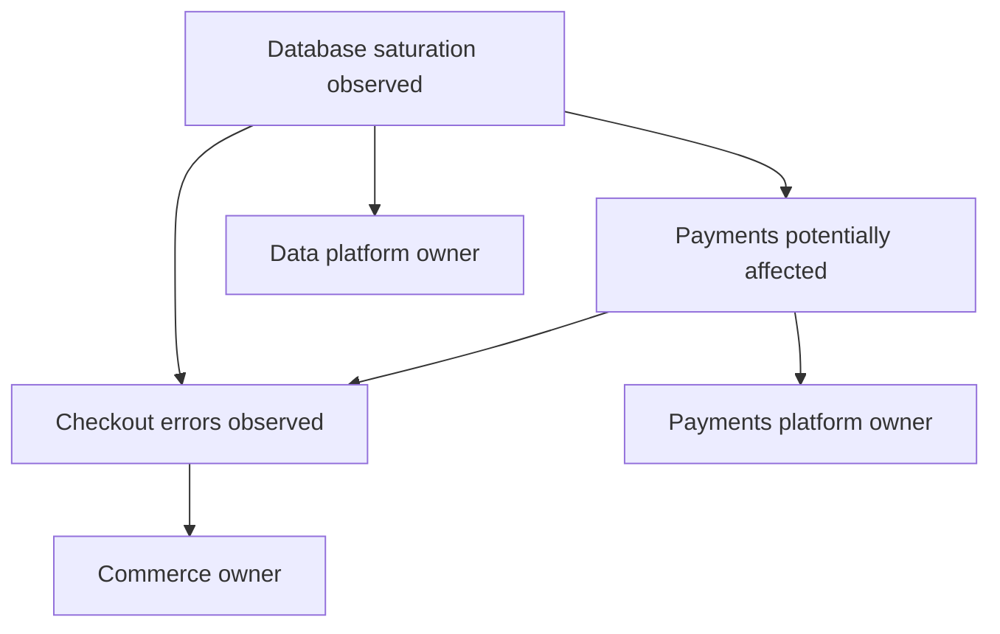
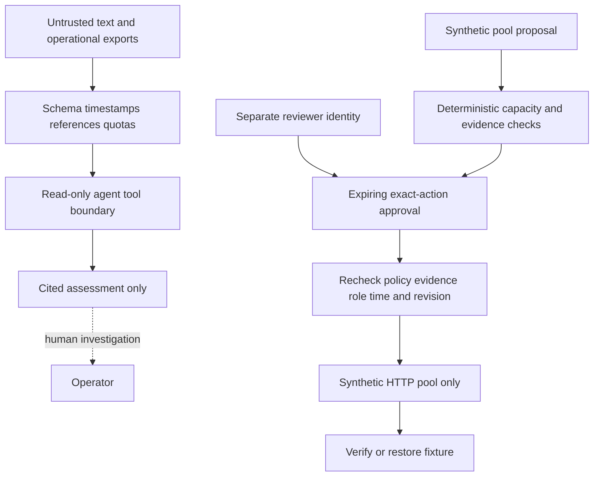
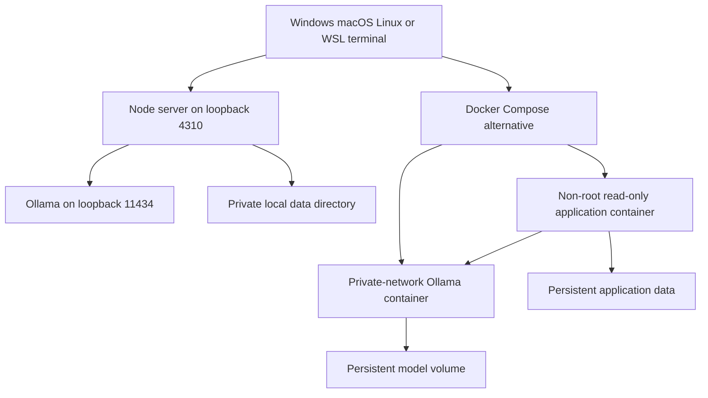
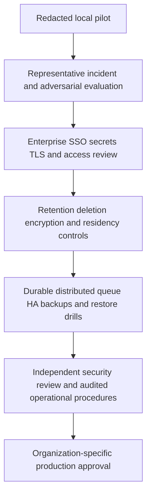

# ChangeGuard

## Agentic change intelligence: connect the incident to the evidence

Maintained by **Anil Kumar Tangirala** · **v0.2.0** · Node.js 24 · local Qwen models · SQLite

[Cross-platform validation](https://github.com/anil7000/changeguard/actions/workflows/validate.yml) · [Actual QA results and repaired defects](VERIFICATION.md)

An operations investigation platform for the question that monitoring alone does not answer: **“What changed, which dependencies and teams could be affected, what evidence supports that explanation, and what must we check before intervening?”**

ChangeGuard combines a reviewed service graph, before/after operational signals, deployment history and runbooks. An LLM plans a bounded investigation, typed read-only tools calculate impact and correlations, hybrid RAG retrieves supporting knowledge, and a skeptical model pass checks each hypothesis. The result is a persisted evidence workspace with owners, citations, tool receipts and explicit uncertainty—not a chat transcript.

**Runnable scope:** a single-node, local-first investigation product with enterprise-oriented safety controls. Real operational exports can be analyzed read-only. The separate execution lab modifies only a synthetic HTTP connection pool. This is not an HA enterprise service, an autonomous production remediator, or a certified compliance product. See the explicit production gates below.

## The real problem and intended outcome

An incident can span multiple teams: checkout errors increase after a database configuration change; the database team sees saturation, the payments team sees latency, and the incident commander has separate dashboards, release logs and stale runbooks. Each team can interpret its own evidence without seeing the dependency chain. A plausible AI explanation is also dangerous if it invents a cause or encourages an unsafe rollback.

ChangeGuard makes that investigation reproducible. It records the supplied measurements, follows the dependency graph toward potentially affected consumers, correlates recent changes, retrieves runbooks with provenance, and challenges its generated findings. It does not replace your monitoring, source-of-truth CMDB or change approval system. It reduces the manual work of assembling and reviewing an evidence packet; no MTTR reduction or production adoption is claimed without a measured deployment.

### Problems addressed by the implemented workflow

| Operational question | Implemented behavior | Important boundary |
|---|---|---|
| Did error rate regress? | Compare before/after error-rate fractions with a supplied limit | Not a statistical causality test |
| Did p95 latency breach its limit? | Compare millisecond measurements | Input windows must be comparable |
| Is a shared dependency saturated? | Evaluate saturation and map consumers | Graph is supplied, not discovered |
| Is a queue accumulating work? | Compare queue depth against its limit | No automatic capacity provisioning |
| Has availability fallen? | Handle lower-is-worse availability thresholds | Not multi-window SLO burn-rate calculation |
| Is replication lag increasing? | Analyze lag in seconds | No database administration commands |
| Is a certificate nearing expiry? | Evaluate remaining days as a preventive signal | Does not renew certificates |
| Which teams could be affected? | Traverse transitive consumers and show owners/criticality | Potential impact is not observed failure |
| Which release is temporally related? | Match same-service/direct-dependency changes within 15 minutes | Correlation is not proven RCA |
| Is recovery evidence missing? | Check rollback availability and seven-day test recency | A recorded flag is not recovery proof |
| Which runbooks support the explanation? | Dense embeddings + lexical ranking + reciprocal-rank fusion | Relevance is not truth |
| Is the explanation actually supported? | Validate citations and review every hypothesis | Same-model review can share the generator's biases |
| Can teams reproduce the investigation? | Export input, model identity, tool hashes, findings and review | Model inference is not guaranteed deterministic |
| Would a pool change exceed capacity? | Separate HTTP rehearsal, independent approval and verified fixture execution | Synthetic lab only |

The same service/owner/signal contract applies to healthcare scheduling infrastructure, retail checkout, commercial SaaS, financial-service infrastructure, manufacturing APIs, telecom and public services. Sector labels are context, not domain-specific decision logic. Do not upload patient records, payment details or personal data; this product provides operational assessment, not clinical or financial advice.

## Architecture and usage diagrams

### 1. Runtime and dependencies



The application has no third-party JavaScript runtime dependencies. Model serving is a separate process. SQLite has an expression index on workflow state and tenant; embedding vectors are cached by tenant, provider/model identity and document fingerprint. A process lock prevents two servers from opening the same runtime database. This is **single-host ownership**, not distributed leader election.

### 2. Required AI investigation sequence



There is no deterministic substitute for unavailable AI. Both reasoning and embeddings are required. Invalid JSON, empty findings, unknown citations, forbidden tools, stale evidence, model errors and rejected review findings hold the workflow. The model must separately cite tool observations and runbooks for each hypothesis. Source-to-consumer paths are validated against the actual graph; the summary's measurements are calculated, not generated. Obvious causal-certainty phrases and numerical claims in free-form mechanisms are rejected. These checks do not prove the remaining natural-language hypotheses true. Tools cannot fetch arbitrary URLs, execute shell commands or write infrastructure. There are three bounded chat calls, at most four distinct tools, a 20 KB serialized prompt budget, and a maximum 300-second timeout per model request. Narrow large investigations rather than silently truncating evidence.

### 3. Dependency impact, not an invented outage map



The input relation is `service.dependsOn`. Impact propagation runs in the reverse direction: a failing dependency can affect its consumers. A visited set terminates cycles. The temporal correlation tool examines the same service and direct dependencies only; it does not claim to prove transitive causality.

### 4. Trust boundaries and execution separation



Model output never grants execution authority. An `assessment` record has no executable action. The lab enforces separate requester/approver identities, digest-bound approval, a 15-minute approval lifetime, a 30-minute investigation lifetime, current evidence, policy version and target revision checks. Invalid/future timestamps fail closed.

### 5. Local and container deployment



### 6. Production adoption and compliance gates



These are **required future adoption gates**, not deployed components or certifications. Hash-linked local audit entries can be rewritten by an administrator who controls the database; export them to a separately controlled immutable system for meaningful tamper evidence. No HIPAA, PCI DSS, SOC 2 or other compliance attestation is claimed.

## Run locally: Windows, macOS, Linux and WSL

Prerequisites: Git, **Node.js 24.x**, and [Ollama](https://ollama.com/download). Start with roughly 16 GB system memory and sufficient free storage for model downloads, runtime libraries and working data; actual memory and latency depend on context, hardware and concurrent jobs. A GPU or Apple Silicon can improve inference latency. Model weights are free to download, but electricity, hardware and hosted compute are not free.

Use PowerShell on Windows, Terminal on macOS, or a Linux/WSL shell. All application commands below are cross-platform Node commands; npm, Python, Java, Bash and `make` are not required.

```text
git clone https://github.com/anil7000/changeguard.git
cd changeguard
node --version
ollama pull qwen3:4b
ollama pull qwen3-embedding:0.6b
node tools/init.mjs
node src/server.mjs
```

1. Ensure Ollama is running. If the desktop application has not started its server, run `ollama serve` in a separate terminal. Do not start a second server on an occupied port.
2. Read the generated engineer token in your local `data/config.json`; never commit or share this file. Open `http://127.0.0.1:4310` and sign in. Tokens remain in browser memory only.
3. Under **Evidence library**, ingest your reviewed incident runbook. For a safe first test, copy [the bundled incident runbook](examples/runbooks/incident-change.md), set a descriptive source reference and ingest it. No external documentation is crawled automatically.
4. Under **Investigate an incident**, choose **Load synthetic example**, inspect the generated current timestamps, and run the investigation. Watch planning, collecting, retrieving, synthesizing and verifying stages.
5. Inspect potential blast radius, service owners, agent plan, tool receipts, retrieved snippets, hypotheses and skeptical review. Export the investigation JSON. `HELD` is a valid safety outcome: inspect its reason rather than treating it as permission to skip AI.
6. To analyze your own incident, paste or open a redacted JSON bundle with the same contract. Preserve real source timestamps; do not relabel old measurements as current.
7. Optional: use the **Synthetic execution lab**. Submit a safe pool change, sign in with the reviewer token to approve it, then use the engineer token to execute and verify the local fixture. Nothing is written to your production platform.

### CLI and runbook ingestion

With the application and models running, in a second terminal:

```text
node tools/assess.mjs
node tools/assess.mjs path/to/reviewed-bundle.json
node tools/smoke.mjs
node --test test/*.test.mjs demo/*.test.mjs
node tools/check-docs.mjs
node tools/benchmark.mjs
```

`assess.mjs` uses the operator from local configuration, submits the generated synthetic bundle when no file is given, and prints the complete result. `smoke.mjs` exercises independent approval and synthetic execution. Tests use explicit HTTP model doubles; they do not require downloaded weights and do not prove model quality. The application itself has no fake-model or deterministic-fallback switch.

Import a reviewed Markdown/text directory with `node tools/ingest.mjs path/to/runbooks`. Set `CG_TOKEN` to the local admin token first. Windows PowerShell uses `$env:CG_TOKEN='...'`; Bash/zsh uses `export CG_TOKEN='...'`. The importer excludes hidden paths, symlinks and common generated directories; it imports at most 50 files with a seven-day expiry. Inspect files before ingesting; no automatic sensitive-data detector is provided.

### OS-specific details and upgrades

- **Windows:** restrict the `data` directory ACL to your account. PowerShell execution-policy changes are unnecessary; invoke Node directly. Use quoted paths containing spaces.
- **macOS/Linux:** protect `data` using your normal filesystem permissions. Native mode avoids container bind-mount ownership issues.
- **WSL:** run Node and Ollama in the same WSL environment for the simplest loopback setup. Windows-host Ollama is not automatically reachable through WSL loopback in every networking mode. Explicitly configure and protect any cross-environment endpoint. Never share an active SQLite database between Windows and WSL processes.
- **Existing v0.1 installation:** stop the server and back up `data`. Run `node tools/init.mjs --configure-local-model` once to add model settings while preserving credentials and creating a config backup. Existing configured model settings are not overwritten. SQLite indexes/cache tables migrate at startup. Old pool approvals fail the new policy-version check; resubmit them for fresh investigation.
- Use `CG_PORT`/`CG_HOST` for the application listener, `CG_CONFIG`/`CG_DB` for alternative files, and `CG_URL` for CLI clients. Defaults bind locally. Do not expose this evaluation server to an untrusted network.
- To use another local Ollama port, set `CG_MODEL_BASE` before starting the server. This is a privileged operator setting that explicitly trusts that exact origin for model HTTP; never derive it from uploaded content.

## Evidence bundle contract

[The executable example generator](examples/incident-bundle.mjs) is the reference. `GET /api/example-bundle` returns a fresh synthetic example after authentication.

| Field | Required data and bounds |
|---|---|
| `capturedAt`, `source` | Valid timestamp within 24 hours; source reference up to 300 characters |
| `services` | 1–80 unique IDs, owner, `critical` or `standard` tier, resolved `dependsOn` IDs |
| `signals` | 1–120 unique IDs; known service; metric, before, after, limit and observed timestamp |
| `deployments` | Up to 80 unique records; service, revision, description, time, rollback flag and tested timestamp/null |
| Metrics | `error_rate`, `latency_p95_ms`, `saturation`, `queue_depth`, `availability`, `replication_lag_s`, `certificate_days` |
| Units | Rates are 0–1 fractions; latency milliseconds; lag seconds; certificate lifetime days; queue depth count |
| Time validity | Signals/deployments must be no later than capture and within its previous 24 hours |

Unknown fields are removed before model use. Freshness and source digests are rechecked after inference. Runbooks have 1–720 hour TTLs; retrieval uses up to 512 chunks of 900 characters and returns five fused-ranked chunks. A bundle can satisfy schema limits but still exceed the smaller model context budget: reduce scope if held. No arbitrary model-requested tool arguments are accepted.

## Free models and paid alternatives

The default is **Qwen3 4B** for bounded structured planning/synthesis/review and **Qwen3-Embedding 0.6B** for retrieval. This is a practical local profile, not a claim that a 4B model is universally best. Qwen3's open-weight models use Apache 2.0; review each downloaded model's license and deployment constraints. [Qwen3 project](https://github.com/QwenLM/Qwen3), [reasoning model](https://ollama.com/library/qwen3:4b), [embedding model](https://ollama.com/library/qwen3-embedding:0.6b).

| Profile | Model/provider option | Trade-off and status |
|---|---|---|
| Default local | Ollama `qwen3:4b` + `qwen3-embedding:0.6b` | No hosted API bill; CPU inference can take minutes; real-model results recorded in verification |
| Larger local | Qwen3 8B or 14B with the same embedding model | More memory/compute; evaluate your own incident corpus before claiming improved quality; not benchmarked here |
| Paid compatibility baseline | OpenAI GPT-4.1 mini + text-embedding-3-small | Documented chat/embedding APIs; no paid calls used in this release's QA |
| Managed open-weight inference | Together AI or Fireworks AI | Choose a currently available model with JSON-output support and a compatible embedding endpoint; model IDs, costs and behavior vary; not live-tested here |
| Different native APIs | Providers requiring another request/authentication shape | Require a provider adapter and contract tests; not a drop-in integration merely because they serve an LLM |

Paid providers can reduce local hardware requirements; they introduce network latency, per-token cost, availability dependencies and data-governance obligations. Sending an incident bundle externally requires your organization's approval. Current provider compatibility and catalogs are documented by [OpenAI GPT-4.1 mini](https://developers.openai.com/api/docs/models/gpt-4.1-mini), [OpenAI embeddings](https://developers.openai.com/api/docs/guides/embeddings), [Together](https://docs.together.ai/docs/inference/openai-compatibility) and [Fireworks](https://docs.fireworks.ai/tools-sdks/openai-compatibility). These are alternatives, not a universal quality ranking.

For a chat-completions-compatible provider, replace only `llm` in your private config; preserve `users`:

```json
{
  "provider": "openai-compatible",
  "url": "https://api.openai.com/v1/chat/completions",
  "model": "gpt-4.1-mini",
  "embeddingUrl": "https://api.openai.com/v1/embeddings",
  "embeddingModel": "text-embedding-3-small",
  "timeoutMs": 120000
}
```

Set `CG_LLM_API_KEY` in the server environment; do not commit it. This adapter sends temperature, a completion-token cap and JSON-object response format. Models with incompatible parameters or native-only APIs require code changes. Both endpoints currently share the same API key, so use a compatible pair from the same approved provider. Clear any `CG_MODEL_BASE` override when switching away from Ollama. Provider responses still pass the same local validators and action boundaries.

Ollama uses its native [chat](https://docs.ollama.com/api/chat) and [embedding](https://docs.ollama.com/api/embed) endpoints. Embeddings are cached locally; changing the provider/model identity changes the cache key. Document edits/deletions invalidate tenant cache entries. Changing a model's underlying weights without changing its configured identity requires re-ingestion to avoid stale vectors.

## Performance: why no Java/Python rewrite?

The current hot path is model inference plus evidence handling, not business-logic arithmetic. Retaining the asynchronous Node control plane avoids an unsupported rewrite while separating model compute into Ollama. Java is a strong candidate for a future high-throughput, CPU-heavy control plane; Python is useful for an ML evaluation/training service. Neither language makes the same external model intrinsically faster.

Java virtual threads address concurrency/throughput rather than making an individual model response faster. Conventional GIL-enabled CPython has CPU-threading constraints; native ML libraries, processes and free-threaded builds change that picture. There is no apples-to-apples Java/Python benchmark in this repository. [Java guidance](https://docs.oracle.com/en/java/javase/26/core/virtual-threads.html), [Python threading guidance](https://docs.python.org/3.13/library/threading.html).

Implemented optimizations: indexed pending-job lookup/counting, no repeated completed-history deserialization, per-tenant serialization with bounded cross-tenant concurrency, batched embeddings, a persistent tenant-scoped vector cache, single-pass lexical statistics and lightweight dashboard summaries. No result cache hides changed source evidence.

On an Intel i7-1270P Windows host, Node 24.19.0, 20,000 completed records in in-memory SQLite: indexed idle-poll p95 **0.0217 ms** over 1,000 samples versus **129.7007 ms** for the legacy full scan over 25 samples. This is a reproducible microbenchmark, not an HTTP SLO, production capacity claim or model-latency benchmark. Run `node tools/benchmark.mjs` on your hardware. Local authenticated summary requests measured **29.99 ms p95** over 100 sequential requests; the final real Qwen CPU investigation took **108.8 seconds**. Faster inference requires a suitable accelerator, different model/serving profile or evaluated hosted provider—not simply a Java/Python rewrite. Full methodology and limits are in [VERIFICATION.md](VERIFICATION.md).

## Container deployment

With Docker Engine or Docker Desktop using Linux containers, first run `node tools/init.mjs` on the host. Then:

```text
docker compose -f compose.yaml -f compose.models.yaml up --build -d
docker compose -f compose.yaml -f compose.models.yaml exec ollama ollama pull qwen3:4b
docker compose -f compose.yaml -f compose.models.yaml exec ollama ollama pull qwen3-embedding:0.6b
node tools/assess.mjs
docker compose -f compose.yaml -f compose.models.yaml logs --tail=100
docker compose -f compose.yaml -f compose.models.yaml down
```

The model container has no published host port. The app is non-root, read-only except its data mount/tmpfs, drops capabilities and binds the host API to loopback. Model memory is separate from the application's 512 MB container cap. Linux bind mounts must allow UID 1000 to write `data`; adjust that specific directory's ownership for your environment, not the repository root. Back up credentials and data before changes. `compose.ci.yaml` is a clearly labeled protocol-double test configuration, **not** the model deployment configuration.

GPU acceleration is not automatically configured by this Compose file. Configure a suitable runtime/device mapping for your OS and hardware if needed. Local CPU deployment remains functional but is not advertised as low-latency inference.

## API and operations

All `/api/*` endpoints require a configured bearer identity. Tenant scope is derived from that identity, never a request field. Mutations are role-gated; requests are limited to 100 KB and 240 calls/minute per authenticated identity. Use `Idempotency-Key` (8–100 safe characters) for submission.

| Endpoint | Behavior |
|---|---|
| `GET /healthz`, `GET /readyz` | Process and database readiness; **not** model readiness |
| `GET /api/me` | Identity, roles and whether a model URL is configured |
| `POST /api/changes` | Submit `kind: assessment` with title/sector/bundle, or a synthetic pool proposal |
| `GET /api/changes` | Latest 200 lightweight tenant job summaries |
| `GET /api/changes/:id` | Complete persisted investigation and receipts |
| `POST /api/changes/:id/approve` | Independent approver; synthetic `REVIEW` jobs only |
| `POST /api/changes/:id/execute` | Operator; approved synthetic action only |
| `POST /api/changes/:id/cancel` | Cancel allowed non-running states |
| `GET/POST /api/documents` | List metadata / ingest reviewed evidence as an admin |
| `DELETE /api/documents/:id` | Withdraw source and invalidate cached embeddings/future execution |
| `GET /api/audit` | Tenant's hash-linked event history |

Inspect persisted `HELD` reasons and model-server logs when inference fails. No unbounded retry loop occurs. An interrupted investigation restarts from its beginning after server recovery; read-only inference may be repeated. Synthetic verification resumes without applying an action twice. Stop cleanly with Ctrl+C before copying the **entire** `data` directory, including any SQLite WAL/SHM files; test restoring the copy separately. Do not delete a lock file while its owning process is alive.

Evidence deletion prevents future use but does **not** erase snapshots already saved in investigations. There is no automated retention/erasure service. Audit history and accumulated jobs need operational retention planning; never describe this as a complete privacy-compliance implementation.

## Verification and production-readiness limits

See [VERIFICATION.md](VERIFICATION.md) for reproduced defects, repairs, test commands, actual model checks and platform evidence. The [CI workflow](.github/workflows/validate.yml) runs native Windows/Linux/macOS tests plus container protocol workflows. Passing protocol tests is not a hallucination-rate, safety-certification or production-scale evaluation.

Before enterprise deployment, implement and validate SSO/OIDC, centralized secrets and encryption, TLS ingress, immutable external audit, tenant/data-retention controls, durable distributed workers/leases, HA storage, representative load and model-quality evaluations, backup/restore objectives, telemetry integration, security review and operational ownership. Live cloud/Kubernetes/observability connectors and production write adapters are not included. The numbered [architecture reference documents](docs/01-product.md) describe future design direction; this README and executable code define the current contract.

Public source availability does not automatically grant an open-source license. This repository has no project-wide license grant yet; model licenses remain separate. Do not infer production adoption, certifications or a service guarantee from this reference implementation.
