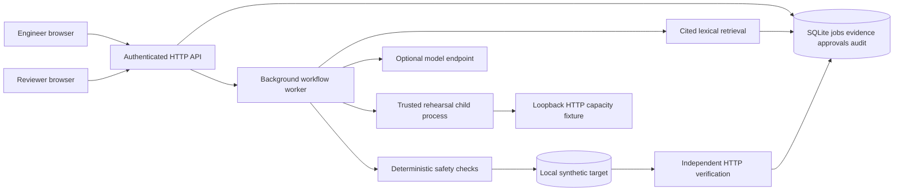
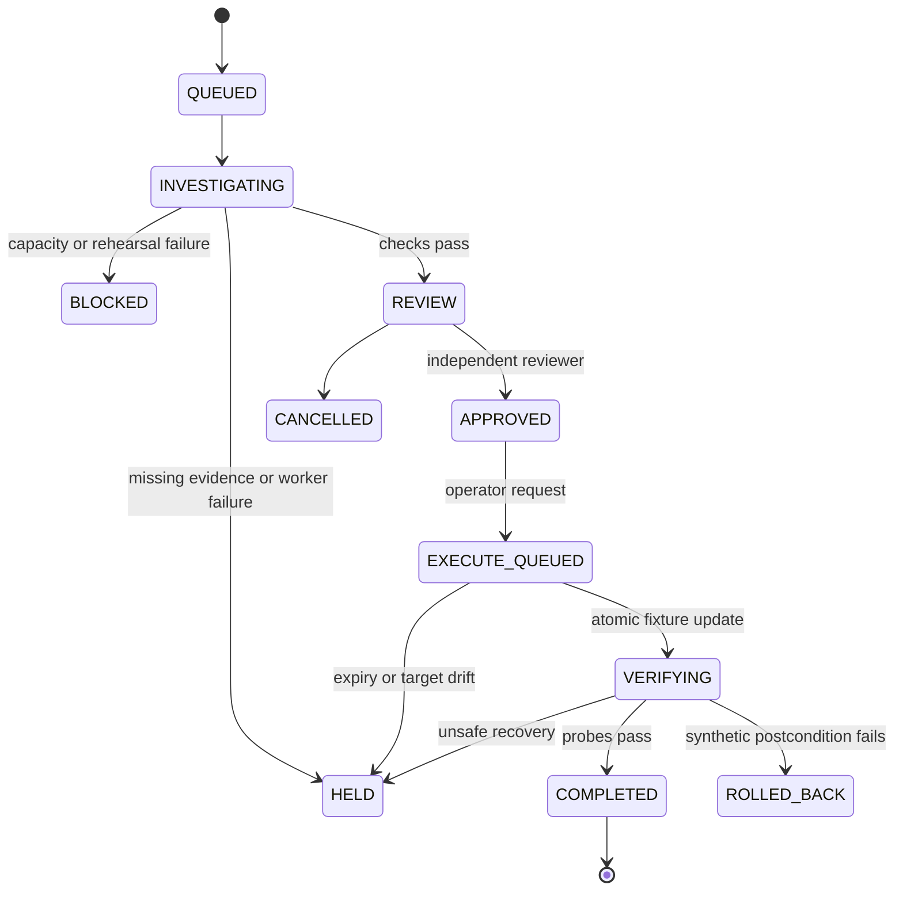
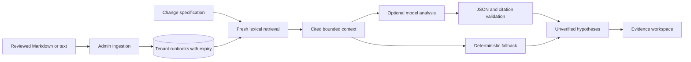
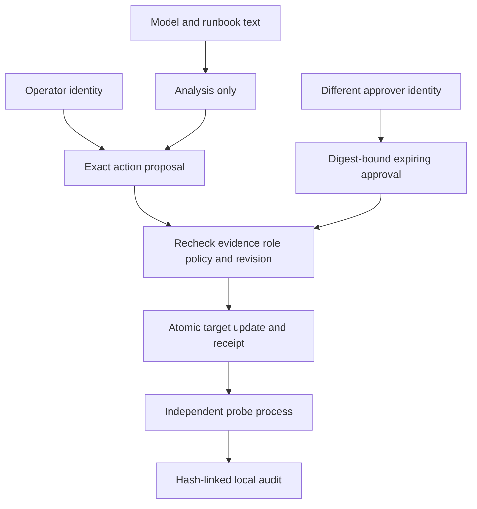
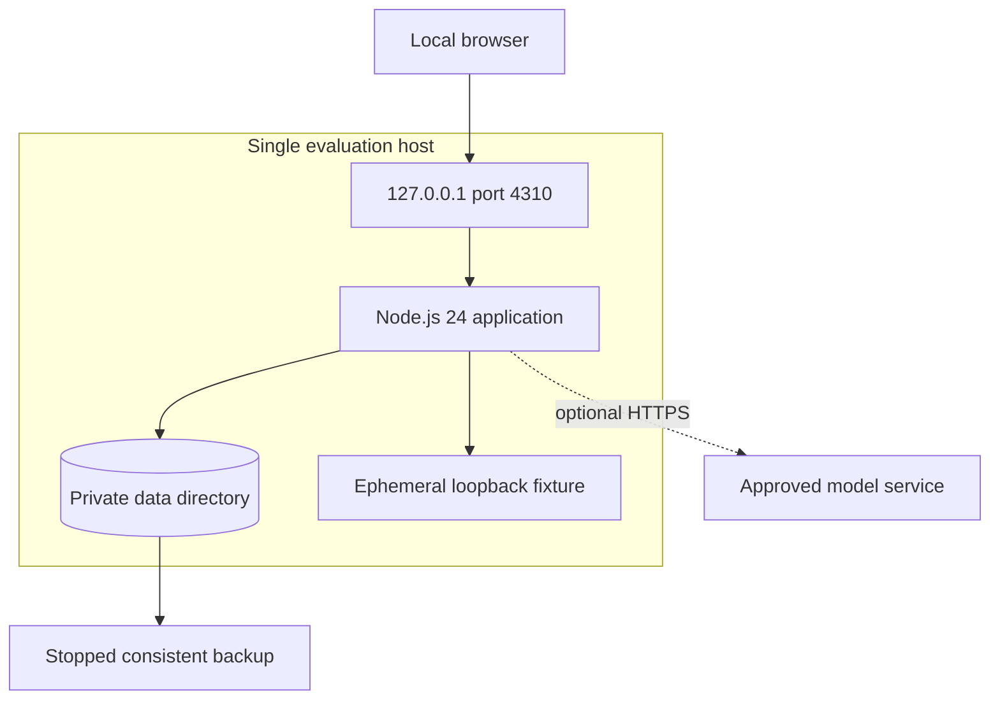
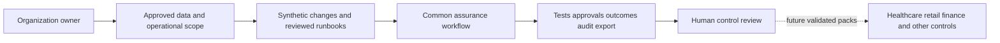

# ChangeGuard

## Evidence before action

**A runnable change-assurance workbench, not a chatbot.** Submit a change, retrieve runbook evidence, rehearse dependency pressure, require independent approval, execute a bounded action and verify the outcome.

Maintained by **Anil Kumar Tangirala**. **v0.1.0: single-node evaluation product.**

Includes a browser dashboard, HTTP API, SQLite persistence, background orchestration, cited retrieval, an optional LLM adapter, role-separated approvals, HTTP rehearsal probes and audit export. No third-party runtime packages or cloud account are required.

**Execution is restricted to a synthetic HTTP connection-pool fixture.** No Kubernetes/cloud write connector, enterprise SSO or compliance certification is included. This is a deployable evaluation application, not an enterprise production release.

## Problem and scope

A service change can pass unit tests yet exhaust a shared dependency. ChangeGuard makes that risk reviewable: it joins configuration, runbook evidence, measured rehearsal results, an exact action and an independent approval. It refuses missing evidence and rechecks target drift before execution.

The operational concepts apply to healthcare scheduling, retail checkout, financial-service infrastructure and other service-based systems. Industry labels do not activate industry-specific regulatory controls or clinical/payment decision-making.

| Capability | Implemented behavior |
|---|---|
| Non-chat dashboard | Change queue, evidence, hypotheses, test results, approvals, execution and audit export |
| Persistent workflow | SQLite transactions, WAL, background jobs and restart reconciliation |
| Knowledge ingestion | Reviewed Markdown/text importer and authenticated runbook API |
| Retrieval | Tenant-scoped lexical chunk ranking, source references, digests and expiry |
| Optional LLM analysis | Chat-completions-compatible adapter, cited hypotheses, bounded responses and fallback |
| Rehearsal | Trusted child process, loopback HTTP fixture, concurrent probes and measured responses |
| Authorization | Bearer identities, tenant scope, operator/admin/approver roles and self-approval rejection |
| Safety | Action digest, approval expiry, evidence validity and target-revision checks |
| Recovery | Resume verification without reapplying; restore the synthetic fixture on failed verification |
| Audit | Hash-linked local events and downloadable JSON |

## Architecture diagrams

All primary architecture and usage diagrams are directly in this README.

### 1. Running architecture



### 2. Change lifecycle



### 3. Retrieval and model boundary



Retrieval uses lexical ranking, not embeddings. Retrieved text is untrusted data. Model output cannot grant approval, select executable commands or mutate the target.

### 4. Security and approval



Authorization is server-side, not button visibility. Tenant identity comes from the configured token, not request data. Workers receive no application credentials. The rehearsal process runs fixed trusted code: it is **not an OS sandbox for arbitrary code**.

### 5. Hosting and dependencies



Docker runs the same application with a writable data mount, read-only filesystem, dropped capabilities, resource limits and health checks. Only one process may own a database. Do not share the SQLite database across hosts or network storage.

### 6. Governance and industry extensions



Evidence supports review; it does not establish regulatory compliance. Future industry packs require separate domain-specific validation.

## Deploy independently: native quick start

### 1. Install and start

Prerequisites: Git, **Node.js 24.x** and an available local port 4310. No `npm install`, external database or model credential is needed.

```sh
git clone https://github.com/anil7000/changeguard.git
cd changeguard
node --version
node tools/init.mjs
node src/server.mjs
```

Open **http://127.0.0.1:4310**. Initialization creates `data/config.json` with random engineer and reviewer tokens and refuses to overwrite existing credentials. Read it locally. Restrict its Windows ACL to your user. Never commit or paste tokens into issues, screenshots or public logs.

### 2. Submit as engineer

Log in with the engineer token. Submit: industry `retail`, replicas `3`, pool per replica `20`, allocated capacity `120`. Confirm the evidence/recovery prerequisites for this synthetic scenario. The worker retrieves evidence and runs actual HTTP probes against an ephemeral fixture. A passing change reaches **REVIEW**, not automatic execution.

The capacity value is the budget allocated to this service after reserving capacity for other clients. These are reviewed fixture inputs, not live discovered telemetry. The fixture models connection allocation; it is not an actual database engine.

### 3. Review with a separate identity

Inspect the evidence, action and measured results. Disconnect; log in with the reviewer token. Select the change and choose **Approve exact action**. Approval lasts 15 minutes and binds the action digest. A requester cannot self-approve even if assigned both roles. Two identities on a laptop demonstrate the control; a real team must assign them to separate people.

### 4. Execute and verify

Return as engineer and choose **Execute in synthetic target**. The server rechecks the approval, source validity, investigation age and expected target revision, updates the local fixture transactionally and runs fresh probes. **COMPLETED** means synthetic verification passed, not a production deployment.

### 5. Exercise safety paths

| Scenario | Input/action | Expected outcome |
|---|---|---|
| Excess demand | Replicas 10, pool 30, capacity 60 | BLOCKED, no target update |
| Unknown capacity | Leave capacity blank | HELD, no guessed capacity |
| Missing approval | Execute before approval | HTTP 409 |
| Self-approval | Requester with approver role | HTTP 403 |
| Evidence withdrawal | Delete cited runbook before execution | Execution denied |
| Target drift | Complete another change against the target | Stale action denied; resubmit |
| Duplicate event | Same idempotency key and payload | Same logical change |
| Interrupted worker | Restart during investigation/verification | Retry investigation or resume verification without duplicate application |

### 6. Stop, back up and restore

Press Ctrl+C. While stopped, copy the whole private `data` directory to protected storage. Do not copy only SQLite while the service writes: WAL state may be required. Restore while stopped and restart. Backups include tokens and evidence; encrypt and access-control them. Rotate tokens by editing protected config while stopped and restarting.

A runtime lock prevents simultaneous owners. Stale locks from dead local processes are reconciled. When moving data across hosts/containers, first verify no instance is running before removing an obsolete `.lock` file. This is a single-host deployment, not a clustered database.

## Local testing across operating systems

The runtime uses Node.js built-ins and portable JavaScript: there are no Bash-only application scripts, native package builds or OS-specific database drivers. Use Node.js 24.x on a supported Windows, macOS or Linux host.

| Environment | Shell and setup notes |
|---|---|
| Windows | PowerShell or Windows Terminal. Run the native quick-start commands unchanged. Allow loopback networking if endpoint security prompts; do not grant public-network access. Restrict config-file ACLs. |
| macOS | Terminal with zsh or bash. Use a native Node.js 24 build for your Mac. Run the same commands; no Homebrew dependency is required by the application. |
| Linux | Bash or another shell with Node.js 24 on PATH. Keep `data` private with directory mode 700 and config mode 600. |
| WSL2 | Install Linux Node.js inside the distribution, clone under the Linux home directory, and run all commands there. Do not mix Windows Node with WSL dependencies or run the same database from both environments. |
| Docker Desktop | Use Linux containers on Windows/macOS. Docker is optional for native local testing. On Linux verify bind-mount UID permissions as described below. |

Native commands are identical in all four environments:

```sh
node tools/init.mjs
node --test test/*.test.mjs demo/*.test.mjs
node tools/check-docs.mjs
node src/server.mjs
```

Keep the server terminal open. In a second terminal, from the same directory, run `node tools/smoke.mjs` to exercise submission, review, execution and verification. For repeated tests with an existing config, skip initialization. The test suite creates and removes only its own temporary test directories; it does not use your installation database.

Environment-variable syntax differs by shell. Example alternate port:

```powershell
# Windows PowerShell
$env:CG_PORT = '4311'
node src/server.mjs
```

```sh
# macOS, Linux and WSL shells
CG_PORT=4311 node src/server.mjs
```

Set `CG_URL` to the matching URL when running the smoke test against an alternate port. WSL localhost forwarding depends on Windows/WSL networking configuration; try the browser inside the distribution or repair localhost forwarding before changing the bind address. Do not expose bearer-token HTTP traffic broadly as a workaround.

The CI matrix tests native Windows, macOS and Ubuntu; Linux container testing is separate. These tests do not certify every OS version, CPU architecture, filesystem or endpoint-security product. Direct WSL verification is listed separately in the evidence report.

## Docker Compose setup details

Docker Engine/Desktop and Compose are required. Initialize config once, then:

```sh
node tools/init.mjs
docker compose up --build -d
docker compose ps
docker compose logs --tail=50
```

If config exists, skip initialization. On Linux, ensure the project data directory is writable by container UID/GID 1000:

```sh
sudo chown -R 1000:1000 ./data
sudo chmod 700 ./data
sudo chmod 600 ./data/config.json
```

Apply these commands only to this dedicated project data directory. The service binds to loopback; do not expose its default HTTP listener directly to the Internet. Shared access requires a separately reviewed TLS reverse proxy, network controls and identity design. `docker compose down` stops the container without removing bind-mounted data.

[VERIFICATION.md](VERIFICATION.md) distinguishes local test results from container CI results. A Dockerfile alone is not proof of successful deployment.

## Ingest reviewed operational knowledge

Use the dashboard Evidence library, or import a reviewed folder. The importer reads only Markdown/text, skips symlinks/hidden/vendor directories, caps individual files at 50 KB and limits each batch to 50 files. It never executes repository code.

PowerShell:

```powershell
$env:CG_TOKEN = (Get-Content data/config.json -Raw | ConvertFrom-Json).users[0].token
node tools/ingest.mjs ./reviewed-runbooks
Remove-Item Env:CG_TOKEN
```

For other shells, set `CG_TOKEN` through a private prompt or secret manager and run the same importer. Set `CG_URL` for another instance; remote URLs require HTTPS. Relative file paths become citations, and reimport updates matching paths. Imported records expire after seven days. The API supports replacement and deletion.

**Deletion withdraws a document from future retrieval and invalidates pending execution; historical investigation snapshots remain in the database.** This is not a full personal-data erasure implementation. Do not ingest regulated records.

## Optional LLM-backed retrieval and generation

Without an endpoint the workflow uses deterministic analysis with cited retrieval. To enable generated hypotheses, add this object to the protected config while preserving its `users` array:

```json
{
  "llm": {
    "url": "https://your-approved-provider.example/v1/chat/completions",
    "model": "your-approved-model"
  }
}
```

Supply `CG_LLM_API_KEY` if the provider needs authentication, then restart. A protected `llm.apiKey` config field is also supported. Docker requires explicit environment forwarding in a private Compose override or approved secret injection; the default Compose file does not forward host variables.

The endpoint must implement chat-completions-compatible JSON. Requests contain change fields and retrieved runbook excerpts: use only provider-approved data. HTTPS is required except for a local loopback model. Calls time out after 15 seconds; redirects are rejected; response size and citations are validated. Failures fall back to deterministic analysis. The adapter is tested with HTTP test doubles; no hosted-model accuracy result is claimed.

## API reference

Use `Authorization: Bearer <token>` on every `/api` call and `Content-Type: application/json` for JSON bodies. Tenant scope derives from the token.

| Route | Required role | Purpose |
|---|---|---|
| GET /healthz, /readyz | Public minimal response | Process and database readiness |
| GET /api/me | Authenticated | Identity and roles |
| GET /api/changes | Authenticated | Latest 200 tenant changes |
| POST /api/changes | Operator | Submit with an `Idempotency-Key` header |
| GET /api/changes/{id} | Authenticated | State, evidence and receipts |
| POST /api/changes/{id}/approve | Approver | Independent approval |
| POST /api/changes/{id}/execute | Operator | Rechecked fixture execution |
| POST /api/changes/{id}/cancel | Operator | Cancel eligible pending work |
| GET /api/target | Authenticated | Target revision and configuration |
| GET /api/documents | Authenticated | Tenant evidence library |
| POST /api/documents | Admin | Ingest/replace runbook |
| DELETE /api/documents/{id} | Admin | Withdraw runbook |
| GET /api/audit | Authenticated | Tenant evidence export |

Example change body:

```json
{
  "title": "Increase checkout concurrency",
  "sector": "retail",
  "replicas": 3,
  "poolPerReplica": 20,
  "capacityBudget": 120,
  "evidenceFresh": true,
  "rollbackTested": true
}
```

Limits: 100 KB request body, 100 runbooks/tenant, 20 pending jobs/tenant and 240 API requests/identity/minute. Maximum replicas: 32; pool/replica: 128; capacity: 4096. A 429 means pause and retry later.

## Security, safety and compliance

- No arbitrary shell commands, untrusted builds or production access.
- Tokens stay in browser memory; untrusted strings render as text with a restrictive content-security policy.
- Approval and execution are separate operations. Evidence withdrawal, expiry and drift are rechecked before dispatch.
- Local audit hashes are not an independently immutable service; a privileged administrator could rewrite the database. Export to independently protected storage when stronger assurance is required.
- Tenant members share read access. Fine-grained source ACLs, OIDC/SSO, automated retention, external immutable audit and multi-region hosting are future work.
- Do not submit patient records, cardholder data or regulated customer records. Industry labels are not certifications. See [HHS cloud guidance](https://www.hhs.gov/hipaa/for-professionals/special-topics/health-information-technology/cloud-computing/index.html), [PCI SSC](https://www.pcisecuritystandards.org/document_library/) and [NIST AI RMF](https://www.nist.gov/itl/ai-risk-management-framework) for organizational assessment references.

## Tests and written evidence

```sh
node --test test/*.test.mjs demo/*.test.mjs
node tools/check-docs.mjs
```

Tests run real HTTP servers, fixture subprocesses and temporary SQLite databases. They cover the complete workflow, tenancy, authorization, malformed requests, idempotency, approval expiry/tampering, evidence withdrawal, drift, rollback, restart recovery and model citation validation. Executed checks, bug fixes and limitations are recorded in [VERIFICATION.md](VERIFICATION.md).

## Troubleshooting

| Symptom | Resolution |
|---|---|
| Missing config | Run initialization once from the project root |
| `node:sqlite` unavailable | Use Node.js 24.x |
| Cannot approve | Use a separate reviewer identity on a REVIEW change |
| HELD or target drift | Inspect the reason; correct inputs/evidence and submit a new change |
| Model fallback warning | Check endpoint, model, credentials and citation response format |
| Docker permission denied | Check UID 1000 access to the project's data directory |
| Port occupied | Set `CG_PORT` for native mode or adjust Compose mapping |
| Database already owned | Stop the existing process; do not run multiple replicas |

## Roadmap and ownership

The documents under `docs/` remain future architecture studies, not the deployment guide. Next work is read-only telemetry connectors, independently validated service models, source-level ACLs and a separately reviewed production action broker. Those capabilities are not included in this release.

Third-party components retain their licenses. A redistribution license for this new repository has not yet been selected; public visibility alone does not grant an open-source license.
