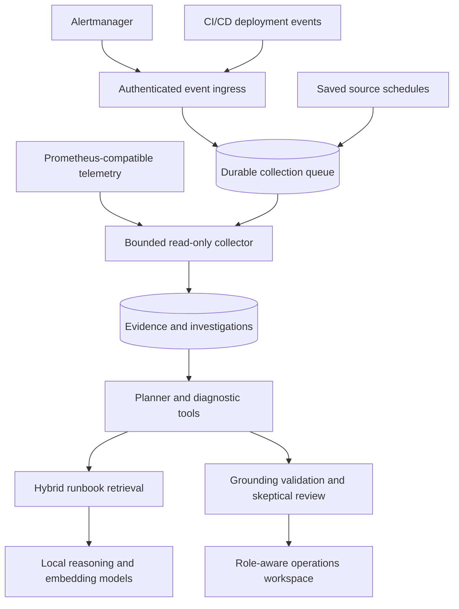
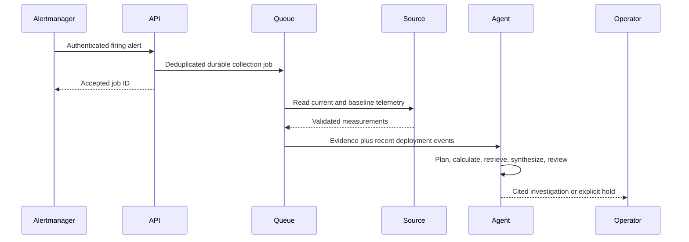
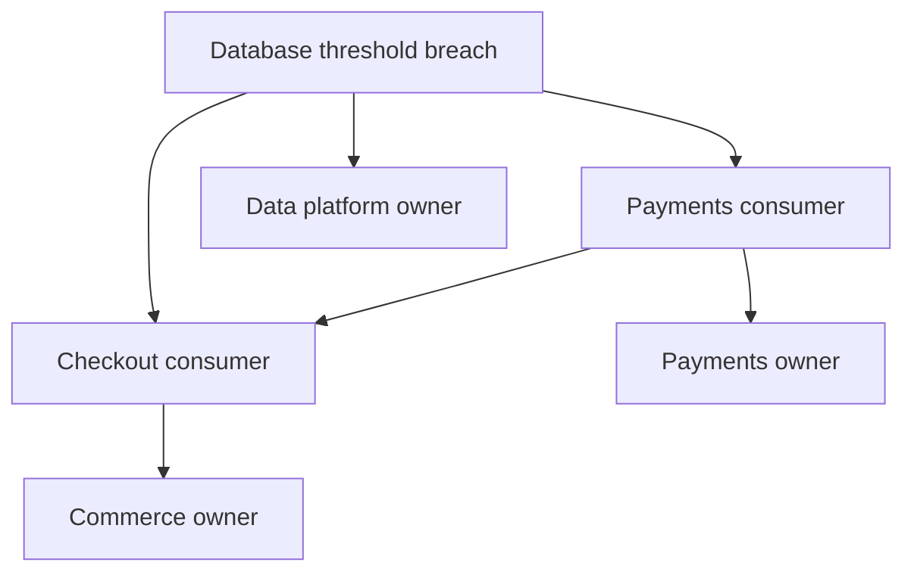
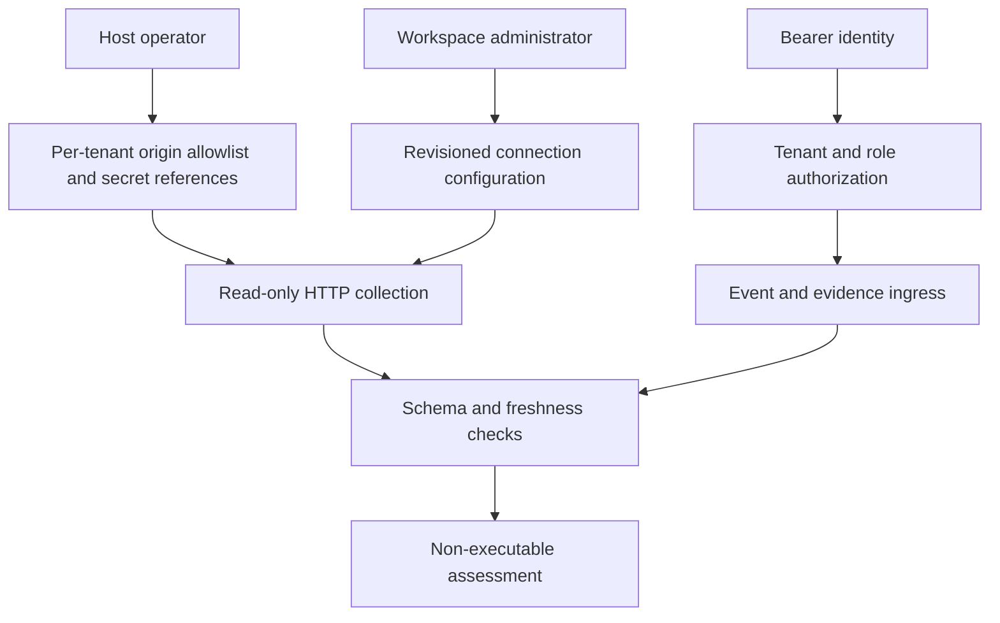
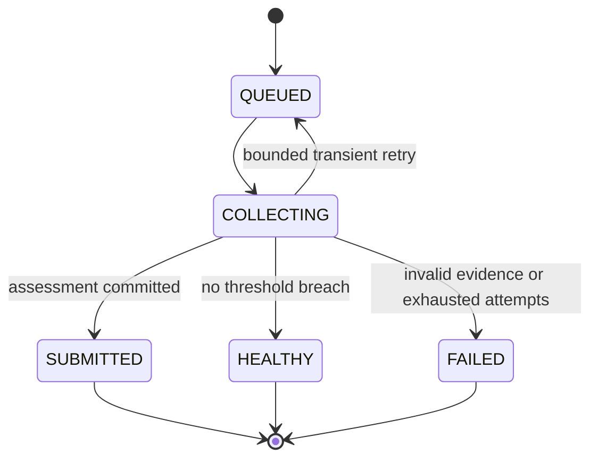
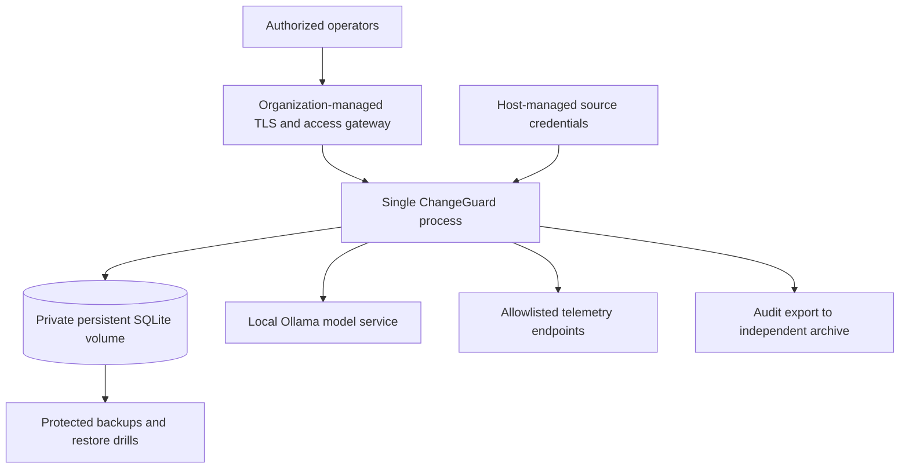

# ChangeGuard

### Autonomous incident investigation, grounded in operational evidence

[](https://github.com/anil7000/changeguard/actions/workflows/validate.yml)

ChangeGuard connects telemetry, deployment events, service ownership and runbooks so operations teams can answer **what degraded, which dependencies could be involved, who owns the affected services, and what evidence to check next**.

Configure a source once. Collect on a schedule or trigger collection from Alertmanager. A bounded agent runs diagnostic tools, retrieves runbook evidence using hybrid RAG, generates cited hypotheses and reviews them before publishing an investigation. Operators work with an evidence workspace, not a chatbot.

**v0.3 supports autonomous read-only investigation.** Production remediation is not enabled. Deploy it as a single-node investigation service behind your organization's access and network controls; it is not an HA platform or a universally certified production deployment.

## What it does

- **Live telemetry:** Prometheus-compatible HTTP query collection, before/after comparisons, explicit thresholds and missing-data rejection.
- **Event-driven investigation:** Alertmanager v4 webhook ingress with persistent duplicate-delivery detection.
- **Continuous operation:** saved connections, per-source schedules, bounded retries, durable collection jobs, restart recovery and tenant queue quotas.
- **Change correlation:** authenticated deployment-event ingestion from CI/CD, joined to the environment's service graph.
- **Required AI and RAG:** local Qwen reasoning, real embeddings, lexical/semantic fusion, source citations and a skeptical review pass. No silent non-AI fallback.
- **Dependency intelligence:** service owners, transitive potential impact, measured breaches, change timing and recovery-readiness checks.
- **Controlled access:** tenant-derived authorization; viewer, operator, approver, administrator and ingestion-only collector roles.
- **Operational controls:** disable connections, revision-protected configuration, host-level collection pause, bounded audit pagination, exported investigations and health diagnostics.
- **Portable installation:** Node.js 24 on Windows, macOS, Linux and WSL; Docker Compose deployment with persistent data and local models.

## Integration compatibility

| Environment / source | Integration |
|---|---|
| Kubernetes, VMs, bare metal, on-premises | Query an authorized Prometheus-compatible endpoint |
| AWS, Azure, Google Cloud or other infrastructure | Same telemetry integration when metrics are available through that protocol |
| Alertmanager | Native v4 webhook receiver; triggers collection from a saved connection |
| GitHub Actions, GitLab CI, Jenkins or other delivery systems | POST deployment evidence using a collector identity |
| Other monitoring systems | Push a normalized evidence bundle through the authenticated ingress API |

No source-code changes are needed for supported protocols. **Configuration is still required:** endpoint authorization, credentials, metric queries, thresholds, service ownership and relevant runbooks. Cloud-native signing protocols, automatic topology discovery, arbitrary raw-log ingestion and unrestricted production commands are not included. A provider requiring SigV4, OAuth token refresh or another unsupported authentication mechanism needs an approved gateway or adapter; a Prometheus-compatible data format alone does not make its authentication compatible.

## Architecture

### 1. Runtime



### 2. Alert-to-investigation workflow



### 3. Dependency impact



Dependencies are supplied as `service.dependsOn`. Potential impact flows toward consumers. A dependency path is not proof of an outage, and deployment timing is not proof of causality.

### 4. Network and identity boundaries



Uploaded text cannot choose destinations, credentials or tools. Redirects are rejected. Source credentials use server-side environment references and require HTTPS outside exact loopback addresses. Restrict outbound traffic at the infrastructure layer as well.

### 5. Collection lifecycle



Collection status is separate from investigation status. `SUBMITTED` means evidence was queued, not that the AI accepted it. The investigation subsequently reaches `ANALYZED` or `HELD`.

### 6. Deployment



## Start locally

Install [Node.js 24](https://nodejs.org/) and [Ollama](https://ollama.com/download). Use PowerShell on Windows or Terminal on macOS/Linux/WSL:

```text
git clone https://github.com/anil7000/changeguard.git
cd changeguard
ollama pull qwen3:4b
ollama pull qwen3-embedding:0.6b
node tools/start.mjs
```

1. Ensure Ollama is running; use `ollama serve` if needed.
2. Open **http://127.0.0.1:4310**. Read the engineer token from the private `data/config.json` and sign in.
3. In **Evidence library**, ingest a reviewed troubleshooting runbook for your environment.
4. For an initial demonstration, use **Load synthetic example** under **Investigate supplied evidence**. Run the investigation and inspect citations and tool receipts.
5. To connect real telemetry, follow the source setup below.

The start command creates configuration only if absent. Existing identities and data are preserved. Models are required; CPU inference can take minutes. Start with sufficient memory and disk for both model weights and inference; roughly 16 GB system RAM is a practical starting point, not a capacity guarantee.

### Connect telemetry without editing application code

Authorize the exact source origin on the host:

```text
node tools/sources.mjs allow --tenant local --origin https://prometheus.example.com --secret-env CG_SOURCE_PROMETHEUS
```

Supply the source token in the **server process environment** using your secret manager. For a local PowerShell session:

```powershell
$env:CG_SOURCE_PROMETHEUS = '<read-only-source-token>'
node tools/start.mjs
```

For Bash/zsh:

```sh
export CG_SOURCE_PROMETHEUS='<read-only-source-token>'
node tools/start.mjs
```

Stop the existing process before restarting. Omit `--secret-env` only when your approved endpoint requires no bearer credential. Never put real secrets into shell scripts or committed files.

In the dashboard:

1. Choose **New connection**.
2. Set its ID, environment and Prometheus base URL.
3. Add the service IDs, owners and dependency relationships.
4. Add scoped PromQL expressions and thresholds. Each query must produce one numeric sample. For example, `avg(up{job="application"})` measures scrape-target availability for that job, not end-user service availability.
5. Choose a baseline window and schedule; `0` disables scheduled collection.
6. Choose **Only on threshold breach** or **Every successful collection**.
7. Save, then choose **Collect now**.
8. Open the resulting investigation from **Collection activity**.

Enablement also activates a nonzero schedule. Start manually, inspect source mapping and evidence, and then enable the desired interval. An invalid or empty query result fails collection; it is never reported as healthy.

[Integration setup, payloads and Alertmanager configuration](docs/integrations.md)

## Roles and operations

| Role | Authority |
|---|---|
| Viewer | Read tenant investigations, connections and audit records |
| Operator | Submit investigations, request collections, publish deployment evidence; operate the synthetic lab |
| Collector | Push evidence/deployments and trigger collections; cannot read investigations or execute actions |
| Approver | Independently approve eligible synthetic-lab proposals; not production remediation |
| Admin | Configure sources and runbooks; inspect identities and authorized origins; enable source schedules |

Roles combine explicitly; administrator does not automatically imply operator. Host operators provision identities and authorize outbound sources.

```text
node tools/access.mjs add --id monitoring --tenant local --roles collector
node tools/access.mjs add --id observer --tenant local --roles viewer
node tools/access.mjs rotate --id monitoring --tenant local
node tools/doctor.mjs
```

Access and source-trust changes take effect after restart. The tools preserve a private configuration backup. Restrict configuration, backups and SQLite files to the service account. The dashboard never reveals identity tokens.

## Deployment and operational guide

Native installation works on Windows, macOS, Linux and WSL. For WSL, run Node and Ollama together in the same environment unless you deliberately configure a protected cross-host endpoint. Do not share one active SQLite database between Windows and WSL processes.

For Docker Compose with local models:

```text
node tools/init.mjs
docker compose -f compose.yaml -f compose.models.yaml up --build -d
docker compose -f compose.yaml -f compose.models.yaml exec ollama ollama pull qwen3:4b
docker compose -f compose.yaml -f compose.models.yaml exec ollama ollama pull qwen3-embedding:0.6b
docker compose -f compose.yaml -f compose.models.yaml exec changeguard node tools/doctor.mjs
```

Skip initialization if configuration already exists. Compose exposes the dashboard on host loopback; Ollama remains on the container network. Use your deployment's secret injection and egress controls for live sources. On Linux, the application data mount must be writable by container UID 1000. GPU device mappings are infrastructure-specific and not configured automatically.

- [Operations, backups, upgrades, limits and API](docs/operations.md)
- [Models and alternative providers](docs/models.md)
- [Security boundaries and deployment requirements](SECURITY.md)
- [Reproducible validation commands](VERIFICATION.md)

## Safe autonomy and production adoption

ChangeGuard independently collects and investigates through configured read-only interfaces. It does **not** autonomously roll back deployments, run shell commands or change cloud resources. Its separate, collapsed execution lab only modifies a local synthetic fixture.

Findings are hypotheses, not proven RCA. Human operators must verify source evidence and use their approved incident/change process. A `HELD` or `FAILED` result is actionable diagnostic information, not permission to bypass safeguards.

Before exposing a deployment beyond a trusted pilot, supply TLS and enterprise identity integration, secret lifecycle management, egress restrictions, retention/deletion policy, backup/restore testing and independent security review. Current storage and workers have single-process ownership, not multi-node HA. Model quality, throughput and environment compatibility must be evaluated on representative operational data. No compliance certification or production adoption is claimed.

Public source availability does not itself grant an open-source license; the repository currently has no project-wide license grant. Model licenses are separate.
