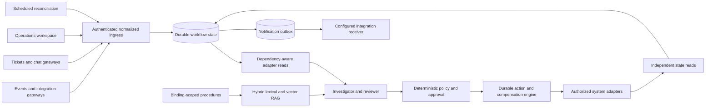
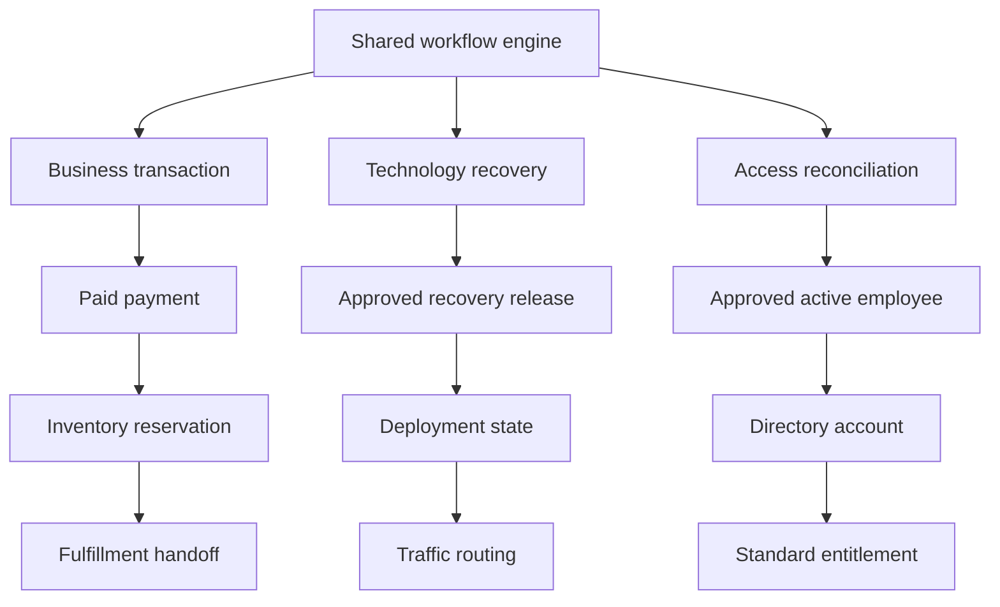
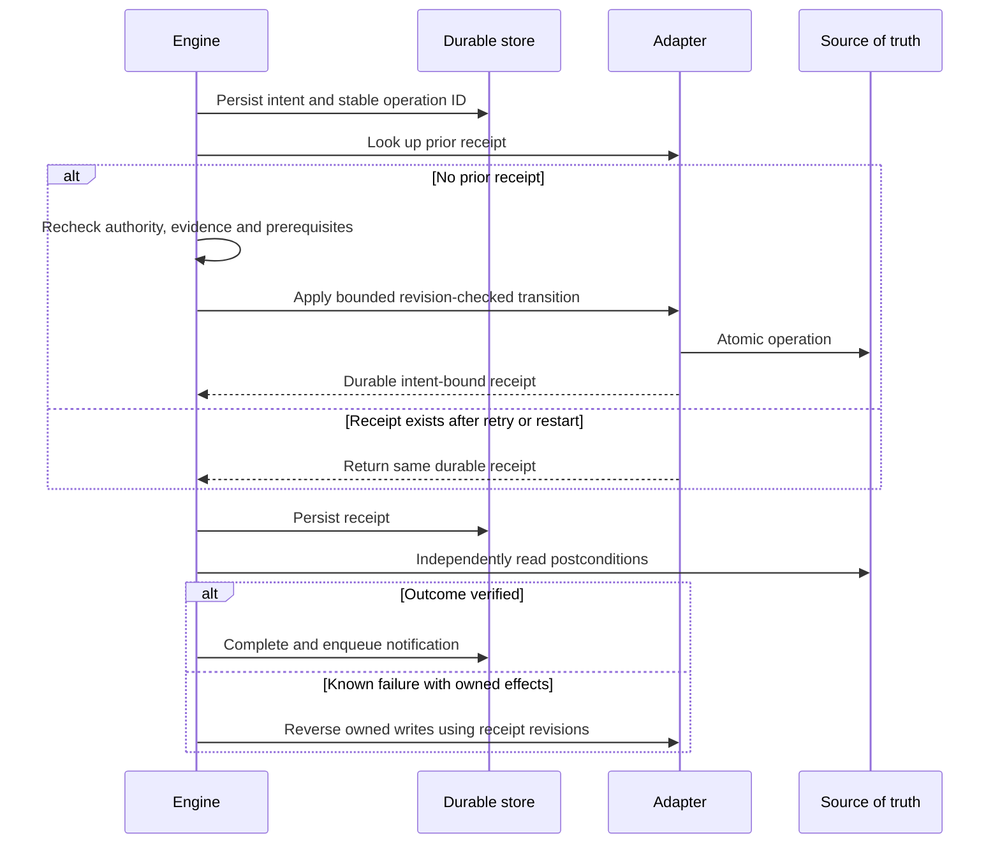
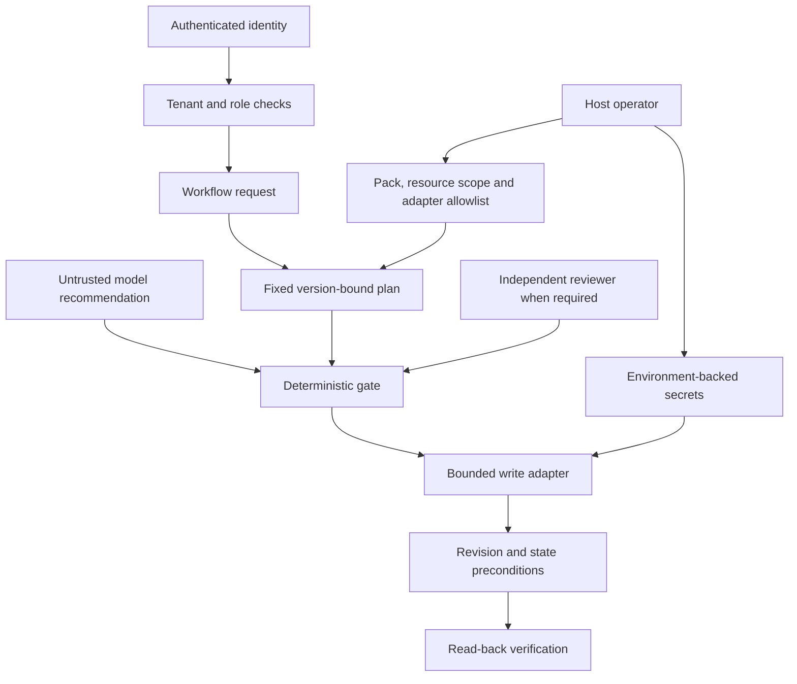
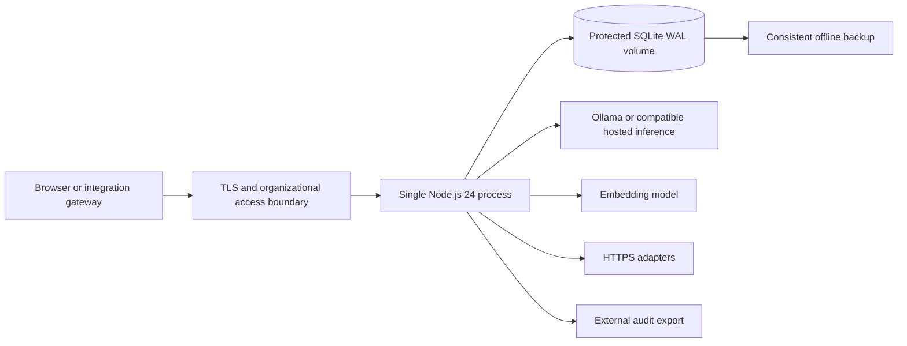
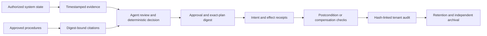

# ChangeGuard

### Cross-system recovery, from evidence to verified outcome

[](https://github.com/anil7000/changeguard/actions/workflows/validate.yml)

**Objective: resolve cross-system operational failures across an enterprise, from discovering the problem through authorized corrective action to verifying the business outcome, with minimal manual coordination.**

A payment succeeds but fulfillment never starts. A deployment recovers but traffic still follows the old route. An employee is approved for access but directory and entitlement systems disagree. Each problem crosses system and team boundaries. People normally assemble evidence, interpret procedures, coordinate permissions and check that the work actually finished.

ChangeGuard supplies a common execution foundation: event intake, dependency-aware evidence collection, LLM investigation, scoped RAG, deterministic policy, durable action intent, independent approvals, compensation and outcome verification. Its primary interface is an operations workspace, not a chat window.

**v0.4 is a runnable, single-node platform with three executable reference workflows and a bounded HTTP adapter contract.** Included systems are isolated reference implementations. Connecting production systems requires qualified adapters and domain-approved procedures; this repository does not claim universal integration, certification or high availability.

## Three domains, one engine

| Workflow | Authoritative prerequisite | Ordered recovery | Verified outcome |
|---|---|---|---|
| Business transaction | Payment is paid | Reserve inventory; queue fulfillment | Payment remains paid, inventory reserved, fulfillment queued |
| Technology recovery | Recovery release approved and tested | Restore deployment; reconcile routing | Authorization valid, deployment restored, routing reconciled |
| Employee access | Active employment and standard-access approval | Enable existing account; apply standard entitlement | HR approval remains valid, account enabled, entitlement standard |

Reference adapters implement these states in separate SQLite-backed HTTP services. They do not charge a real card, deploy Kubernetes workloads or grant real employee access. Production adapters must map each operation and postcondition to the actual source of truth; an HTTP acknowledgment alone is not proof of business success.

Host-configured custom packs define additional bounded procedures without changing the engine: explicit roles, acyclic dependency edges, guard conditions and ordered reversible transitions. Healthcare, finance, manufacturing and other industries supply their own integrations and acceptance rules. See the [product scope](docs/product-scope.md) and [workflow contract](docs/workflows.md).

## Run locally: Windows, Linux, macOS or WSL

Requirements: Git, Node.js **24.x**, and Ollama for local inference. There are no third-party npm runtime dependencies. Model inference is the dominant resource requirement; CPU-only runs can take minutes. Measure hardware capacity and latency on your deployment.

### 1. Get the project and models

```text
git clone https://github.com/anil7000/changeguard.git
cd changeguard
node --version
ollama pull qwen3:4b
ollama pull qwen3-embedding:0.6b
```

Start Ollama if needed (`ollama serve` in a separate terminal). Default origin: `http://127.0.0.1:11434`.

### 2. Start the complete reference environment

```text
node tools/reference.mjs
```

Open [the recovery workspace](http://127.0.0.1:4315). The launcher starts the application and **nine independent HTTP adapter services** on ports 4320–4328, each with its own durable database. They run in one launcher process for convenient local testing. No production credentials or systems are used.

Private configuration is created at `data/reference/config.json`. Read the `engineer` token locally and enter it in the browser. Use the separate `reviewer` token for independent approval. Tokens stay in browser memory, not URLs or browser storage.

Windows PowerShell:

```powershell
(Get-Content data/reference/config.json -Raw | ConvertFrom-Json).users | Select-Object id,token
```

Linux, macOS, WSL, or any terminal with Node:

```text
node -e "console.log(JSON.parse(require('node:fs').readFileSync('data/reference/config.json','utf8')).users.map(u=>({id:u.id,token:u.token})))"
```

Treat terminal output as secret; never paste it into issues. Restrict the data directory to the service account, including Windows directory ACLs. The reference environment has separate credentials and databases from a normal installation.

### 3. Use all three workflows

1. Sign in as `engineer` and select an authorized workflow.
2. Enter resource `demo-1`, keep a unique source event ID and the supplied problem description.
3. Select **Investigate and recover**. Collection, scoped retrieval, investigation, model review and policy evaluation run automatically.
4. Business and technology reference bindings execute automatically when eligible. Access reconciliation stops at **REVIEW**. Disconnect, sign in as `reviewer`, open the workflow and approve its exact plan.
5. Inspect the resulting record. **COMPLETED** means authoritative postconditions passed. Review citations, action receipts, expected revisions and final checks; export the evidence if needed.

Use `demo-2` through `demo-20` for fresh runs. Resources and receipts survive restart. A completed resource produces no-write verification when it already satisfies the desired state. Reusing the same source event ID with different content is rejected.

### 4. Exercise failure and recovery

| Resource | Injected condition | Expected behavior |
|---|---|---|
| `demo-held` | Authoritative prerequisite unknown | HELD, no writes |
| `demo-rejected` | Second action rejects with a known no-effect conflict | First action compensated; COMPENSATED, original problem unresolved |
| `demo-timeout` | First action commits but response is lost | Automatic receipt reconciliation; no duplicate effect; completion if remaining checks pass |

Access workflows still require independent approval. Model rejection, unavailable models or invalid evidence can instead hold a workflow before execution; no result is fabricated to bypass these conditions.

Scripted validation against the running reference environment:

```text
node tools/workflow-smoke.mjs
node tools/workflow-smoke.mjs --failure-cases
```

The script uses both reference identities to exercise approval. For UI/protocol tests without inference, start a separate disposable environment using `node tools/reference.mjs --protocol-test-double`. This explicit option does **not** validate AI quality.

### Platform-specific settings

Scripts use Node APIs: no Bash, Make, Python or Java requirement. Native PowerShell needs no execution-policy change. On WSL, run application and model in WSL or configure a reachable model origin. Never open the same SQLite installation from Windows and WSL simultaneously.

Different local model port, PowerShell:

```powershell
$env:CG_MODEL_BASE='http://127.0.0.1:11435'
node tools/reference.mjs
```

Linux/macOS/WSL:

```sh
CG_MODEL_BASE=http://127.0.0.1:11435 node tools/reference.mjs
```

`CG_PORT` changes the UI port; `CG_REFERENCE_BASE_PORT` changes adapter ports at initialization; `CG_REFERENCE_DATA` selects a separate installation. Existing endpoints are not silently rewritten when ports change: use a new directory or explicitly review saved configuration. Ctrl+C stops the services; restart the same command to resume durable work.

## Architecture

### 1. Enterprise execution foundation



Ticket/chat/event inputs share an API. Native Slack, Jira, ServiceNow and cloud-provider connectors are not bundled; a gateway translates payloads and receives status callbacks. Incoming events cannot choose arbitrary destinations or actions.

### 2. Shared engine, different dependency graphs



Dependencies are declared process relationships, not automatically discovered topology. Custom packs extend this graph and transition contract. Unsupported or ambiguous states require human judgment.

### 3. Durable execution and uncertainty



This is at-least-once delivery with idempotent adapters, not distributed exactly-once execution. An adapter must atomically record effects/receipts or use an equivalent provider idempotency mechanism. A timeout never proves an action failed.

### 4. Authorization and safety



Collectors can trigger host-authorized workflows but cannot read workspace data. An automatic binding may perform its permitted writes following collector events: that identity is an execution-triggering capability, not just a monitoring credential. Models never obtain credentials or an arbitrary command tool.

### 5. Hosting and dependencies



Normal installation: `node tools/init.mjs`, configure private bindings and approved documents, then `node tools/start.mjs`. UI port: 4310. Existing v0.3 records remain available; telemetry investigations move to `/investigations`. Migrations add tables without deleting data. Stop the service and back up its data before upgrading.

`docker compose up --build -d` runs the normal application with initialized configuration. For the complete reference environment and containerized local models:

```text
docker compose -f compose.reference.yaml up --build -d
docker compose -f compose.reference.yaml exec ollama ollama pull qwen3:4b
docker compose -f compose.reference.yaml exec ollama ollama pull qwen3-embedding:0.6b
```

Open port 4315 and read the generated token in `data/reference/config.json`. The model service stays internal to the Compose network. Volume ownership must allow UID 1000 to create private files. Do not expose the reference environment publicly. See [operations](docs/operations.md).

### 6. Evidence and compliance responsibilities



These controls support review; they do not confer HIPAA, PCI DSS, SOC 2 or other compliance. Configure identity federation at an approved boundary, data classification, model-provider agreements, encryption, retention, incident procedures and independent audit storage. Local administrators can rewrite the audit database. See [SECURITY.md](SECURITY.md).

## Connect a real environment once

1. Approve a workflow pack's authoritative sources, reversible actions and acceptance conditions.
2. Implement or qualify the [adapter contract](docs/workflows.md). Adapters independently enforce resource scope, revision checks, idempotency and durable receipts.
3. Configure exact tenant origins, server-side secret references, resource prefixes, selected procedure IDs and automatic versus approval policy. Treat configuration as privileged code.
4. Ingest approved procedures through `/api/documents`. Expired or withdrawn evidence prevents new writes.
5. Connect existing event/ticket/chat/CI gateways to `POST /api/workflows`; optionally add reconciliation schedules and a notification receiver. Routine users do not recreate mappings per incident.
6. Rehearse failures in staging before enabling production bindings. Irreversible actions and unsupported states require a different approved procedure or human handling.

## Models

Local defaults are `qwen3:4b` reasoning and `qwen3-embedding:0.6b` embeddings, with lexical matching and reciprocal-rank fusion. Both inference and embeddings are required; no silent heuristic fallback exists. Review model licenses, data handling and task-specific quality before adoption.

Compatible paid/hosted models can use supported chat-completions and embedding JSON envelopes over HTTPS, with environment-supplied credentials. Provider-specific APIs need an adapter. Larger models must pass the same schema, citation, safety and latency evaluations. See [model configuration](docs/models.md).

## Validation and deployment limits

```text
node --test test/*.test.mjs demo/*.test.mjs
node tools/check-docs.mjs
```

Tests cover three domains, tenant authorization, duplicate events, lost acknowledgments, restart reconciliation, malformed approvals, withdrawn authority, RAG isolation, drift, compensation, schedules and notification failures. Protocol doubles validate orchestration, not reasoning quality; real-model smoke testing is separate. See [validation](VERIFICATION.md).

Current boundaries: one process owns one SQLite database; no distributed leader election, native SSO, automatic enterprise topology discovery, vendor connector marketplace, automatic erasure service or production-scale SLA. Heterogeneous systems are not globally atomic. Cross-system races are checked before writes and detected through verification; adapters must enforce stronger domain invariants where needed. Compensation stops on conflicting external changes, retaining the workflow's resource lock for safe reconciliation.

Production readiness belongs to a qualified deployment and its integrations, not a label inferred from a passing local demonstration.
