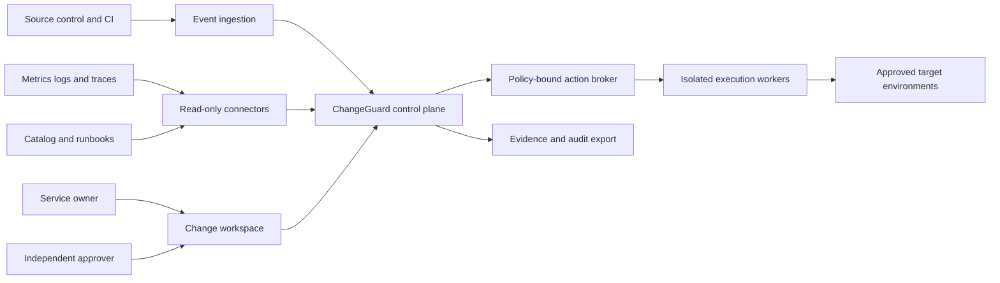
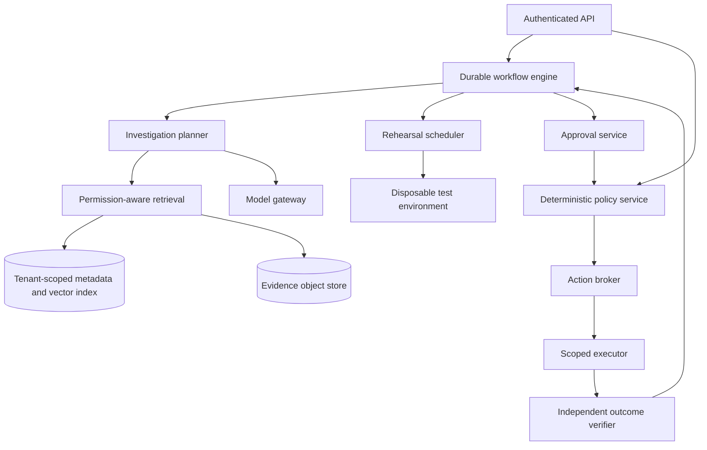

# System architecture

[Documentation index](../README.md)

All distributed components below are proposed. The local demonstrator implements only a small, deterministic decision function.

## 1. System context

## 2. Component architecture

## Domain ownership

| Domain | Owns | Must not own |
|---|---|---|
| Ingestion | Event authenticity, deduplication and normalization | Execution authority |
| Evidence | Source snapshots, ACL metadata and freshness | Approval decisions |
| Investigation | Hypotheses and test proposals | Unrestricted shell access |
| Policy | Authorization decisions and policy versions | Model-generated policy deployment |
| Execution | Typed, scoped actions and receipts | Approval issuance |
| Verification | Postconditions and independent telemetry | Concealing partial failures |

Start as a modular control-plane service with a separately isolated worker, not dozens of microservices. Split domains when isolation, load or independent release needs justify it. Use asynchronous durable workflows for long-running tests; use synchronous policy checks immediately before each side effect.

## Proposed technology decisions

TypeScript API and UI; PostgreSQL for transactional records and initial relationship tables; an optional vector extension for retrieval; S3-compatible evidence storage; a durable workflow engine such as Temporal; an OPA-compatible policy boundary; OpenTelemetry instrumentation; Kubernetes for production workers. These are design choices, not installed dependencies or validated version combinations.

A graph database is deferred: relational edge tables suffice until measured traversal requirements justify another operational dependency. A single model gateway isolates model-provider differences and routes according to data classification. Deterministic checks remain available when models are unavailable.

## Scaling and consistency

Partition queues by tenant and workload class. Bound fan-out per investigation. Cache only by tenant, authorization scope and evidence version. Store state transitions transactionally with an outbox; delivery may be at least once. External actions require idempotency keys and reconciliation, not an unsupported exactly-once guarantee. Use per-target fencing to prevent two workflows mutating the same resource concurrently.
