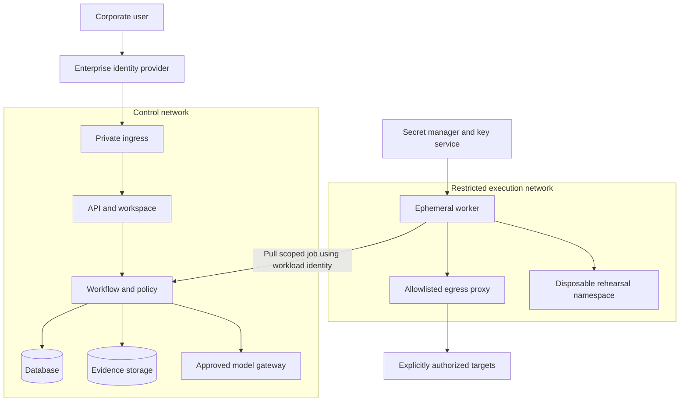
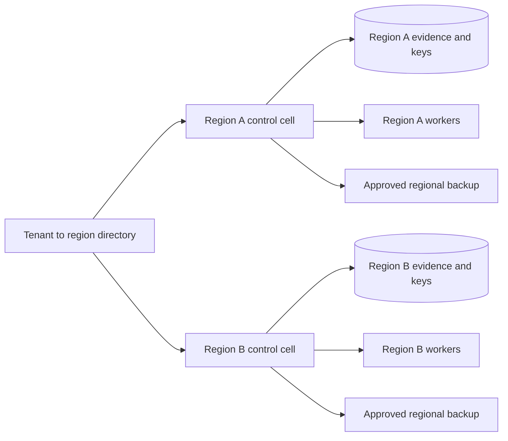

# Hosting, deployment and dependencies

[Documentation index](../README.md)

## Hosting choices

| Mode | Intended use | Isolation and operational trade-off |
|---|---|---|
| Offline demonstrator, implemented | Evaluate decision rules using synthetic inputs | Node.js only; no hosted platform |
| Single-host lab, proposed | Integrate a disposable cluster and sample telemetry | Containerized services; no production assurance |
| Private Kubernetes, proposed | Enterprise-controlled networks and identities | Dedicated data stores, key management and worker pools |
| Regional cells, proposed | Multiple tenant groups or residency zones | Independent cells; explicit routing and no automatic cross-region data transfer |
| Disconnected, proposed | Restricted environments | Local models, mirrored artifacts and offline update process; limited external integrations |

No deployment chart, cloud account or managed service has been provisioned by this documentation package.

## 3. Private deployment topology

Workers initiate authenticated connections to retrieve jobs; production networks do not need arbitrary inbound model access. Separate rehearsal and production identities. Separate the platform's administrative access from target access.

## Dependency matrix

| Dependency | Reason | Failure behavior |
|---|---|---|
| Identity provider | Human identity and groups | No new privileged sessions; short-lived sessions expire |
| PostgreSQL | Durable state and authorization records | Stop state-changing workflows |
| Object storage | Immutable evidence references | Hold actions requiring unavailable evidence |
| Workflow engine | Retry, timers and recovery | Existing applications continue; new platform work queues |
| Secret manager | Short-lived connector credentials | Deny new executions; never fall back to embedded credentials |
| Model endpoint | Hypothesis and test proposal | Bounded retry, then rules-only analysis or explicit hold |
| Telemetry backend | Baselines and postconditions | Pause progression; do not infer health from missing data |
| Source control | Diffs, ownership and PR delivery | Retain investigation; do not fabricate current revision |

Before implementation, select supported versions, pin artifact digests, verify licenses, establish upgrade ownership and record an SBOM. A dependency being named here does not establish compatibility.

## 4. Regional cell model

The directory stores routing identifiers, not evidence. Cross-region recovery requires an approved residency and key-access plan. Avoid active-active mutation of the same target in the first release. Capacity sizing must come from measured event rates, evidence volume, workflow duration and model latency; there are no invented enterprise throughput claims.
