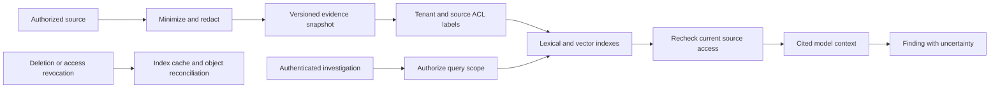

# Data model, retrieval and integration contracts

[Documentation index](../README.md)

## 5. Evidence lifecycle

Treat retrieved text as untrusted data. It cannot override workflow policy or authorize tools. Filter before retrieval and recheck before returning evidence; post-filtering alone can leak through snippets, counts or cache behavior. Source revocation must invalidate retrieval caches and pending action eligibility.

## Core records

| Record | Required fields |
|---|---|
| Change | tenantId, changeId, sourceRevision, targetRefs, actor, observedAt |
| Dependency edge | source, target, relation, provenance, observedAt, confidence |
| Evidence | tenantId, evidenceId, sourceURI, digest, classification, ACL, capturedAt, expiresAt |
| Hypothesis | claim, supportingEvidence, contradictingEvidence, proposedTest, status |
| Action | actionId, typedOperation, targets, diffDigest, evidenceDigest, policyVersion, preconditions |
| Approval | actionDigest, approver, role, issuedAt, expiresAt, decision |
| Execution | actionDigest, idempotencyKey, workerIdentity, receipt, outcome, timestamps |

Never accept tenant identity merely because an event body asserts it. Derive tenant binding from authenticated integration registration. Audit who accessed evidence as well as who changed infrastructure.

## Proposed API surface

These endpoints specify future contracts; no API server is included.

| Endpoint | Semantics |
|---|---|
| POST /v1/changes | Ingest an authenticated event with idempotency key; return investigation ID |
| GET /v1/investigations/{id} | Return authorized evidence and workflow state |
| POST /v1/actions/{id}/approvals | Submit an authenticated human decision bound to the action digest |
| POST /v1/actions/{id}/execute | Recheck policy, revision and approval; enqueue a bounded action |
| POST /v1/workflows/{id}/cancel | Stop new work; reconcile any in-flight external operation |
| GET /v1/audit-exports/{id} | Retrieve an access-controlled export with manifest hashes |

Use versioned JSON schemas and reject unknown action types. Webhook integrations validate signatures, timestamp windows and replay IDs. API clients use scoped OAuth or workload identity, never a shared administrator token. Retry read operations with bounded backoff; reconcile ambiguous writes before retrying.

## Connector priorities

First: GitHub or GitLab change metadata, Kubernetes read-only inventory, Prometheus metrics and a local runbook directory. Next: OpenTelemetry traces, infrastructure plan artifacts and service catalogs. Later: approved feature-flag and cloud APIs. Each connector declares permitted data classes, rate limits, pagination behavior, cursor recovery and maximum evidence age.

Keep source-native operational records in their original systems when possible. Store minimal snapshots necessary for reproducibility. Embeddings can expose sensitive information and require the same classification, residency and deletion discipline as source text.

## Retrieval evaluation

Use reviewed questions and change scenarios with known relevant documents. Measure evidence recall, citation correctness, stale-source rejection and unauthorized retrieval separately. Hold out scenarios by service or incident family to reduce leakage. Record model, prompt and index versions; a model change requires re-evaluation before promotion.
