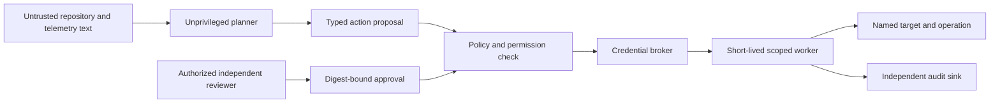

# Security architecture and threat model

[Documentation index](../README.md)

## 6. Authority boundaries

No direct path connects retrieved instructions or a model to credentials. Approval alone is insufficient: the broker must revalidate target state, policy version, evidence validity and revocation immediately before issuing a short-lived capability.

## Threats and controls

| Threat | Proposed control | Verification |
|---|---|---|
| Prompt injection in a runbook | Treat content as data; typed tools; independent policy boundary | Malicious source asks for secret exfiltration and is denied |
| Cross-tenant retrieval | Tenant-scoped storage, row policies, ACL-aware indexes and caches | Adversarial tenant identity and cache reuse tests |
| Approval replay or diff substitution | Canonical digest, expiry and one-action binding | Change a target or diff after approval and reject execution |
| Compromised worker | Ephemeral isolation, read-only filesystem, no host mounts, bounded egress | Attempt lateral access and persistence |
| Webhook forgery | Signature verification and deduplication | Invalid signature and replay fixtures |
| Secret leakage to models | Field allowlists, redaction and route restrictions | Seed canary secrets and assert no provider payload contains them |
| Dependency compromise | Pinned artifacts, provenance checks and vulnerability review | Reject unapproved artifact digest |
| Privileged insider | Separation of duties and independent audit storage | Requester cannot self-approve high-impact action |

## Identity and tenancy

Use OIDC for humans, workload identity for services and short-lived credentials for targets. Define viewer, investigator, proposer, approver, executor and platform-admin roles. A platform administrator should not automatically gain business evidence access or production approval rights.

For high-assurance customers, prefer dedicated databases, evidence buckets, encryption keys and workers. Shared deployments require independently tested isolation at API, database, object, vector, queue, cache and observability layers. Namespace separation alone is insufficient.

## Supply chain and vulnerability handling

Require branch protection, reviewed releases, dependency inventory and signed artifacts before production distribution. Never execute repository-provided test scripts with production credentials. Apply resource and network limits to builds because tests themselves are untrusted code.

Security reporting and response ownership must be established before public production use. Do not request vulnerability reports containing live credentials or regulated data. Publish a supported-version policy and remediation process when the first executable platform release exists.

## Residual risks

Incorrect source data, compromised administrators, incomplete dependency graphs and model mistakes remain possible. Strong isolation adds cost and operational work. Redaction cannot guarantee all sensitive material is detected; minimize collection first. The local demo does not implement these security controls and must not be exposed as an authorization service.
