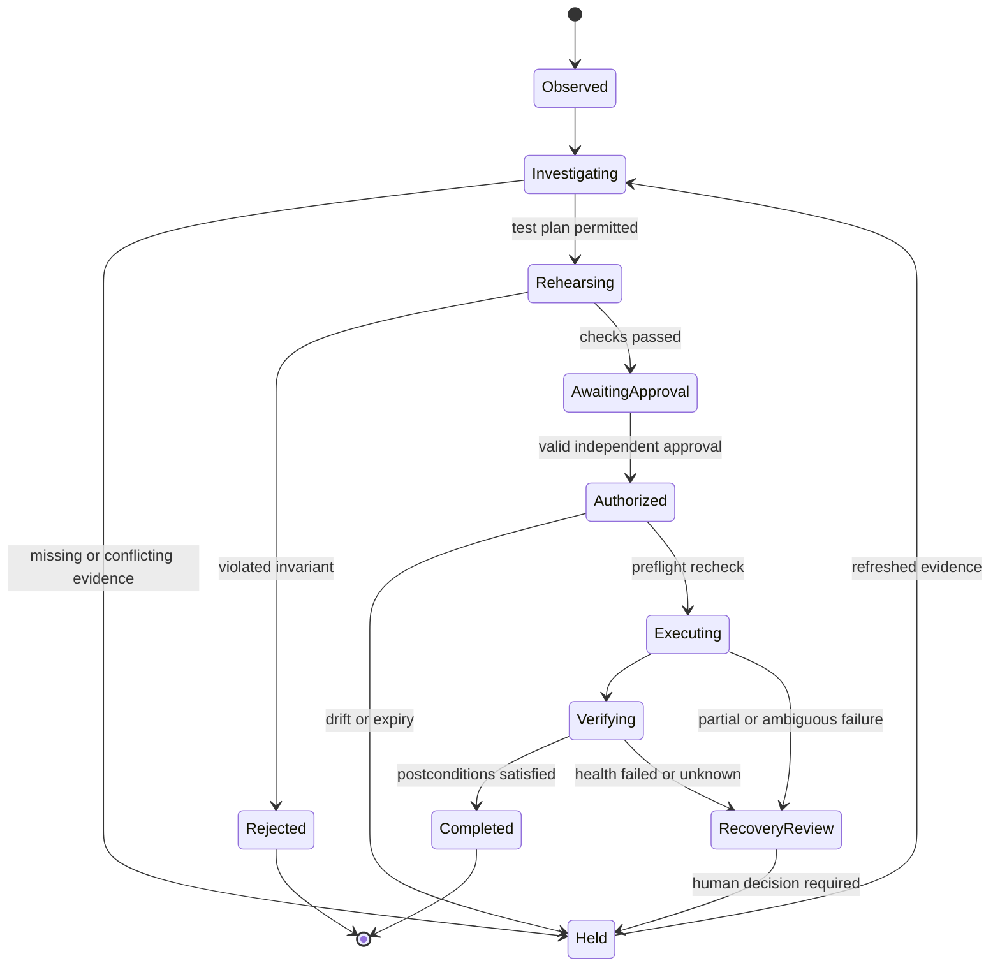
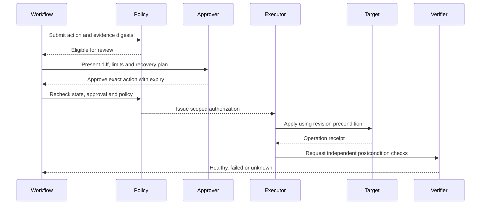

# Safety, approval and execution semantics

[Documentation index](../README.md)

## 7. Change state machine

## Action classes

Read-only investigation is still scoped and rate-limited. Rehearsal may write only to disposable resources. PR preparation may change only a designated branch. Production mutation requires a named operation, exact targets, expiry, revision checks and independent approval. Destructive data operations are outside the first release.

## 8. Execution sequence

Production authorization binds canonical action content, target identity, source revision, policy version and evidence digest. The broker checks the approved digest against the submitted action, then checks current target revision. Approval invalidates on drift. Cryptographic approval verification is proposed, not implemented by the offline demo.

## Recovery is not always rollback

Schema migrations, data transformations and external messages may be irreversible. Require explicit recovery eligibility. Compensating actions need their own reviewed scope; do not blindly execute inverse commands. When a timeout leaves the result unknown, query the target using an operation identifier before retrying.

The emergency stop prevents new action dispatch and revokes credentials where supported. It cannot guarantee an already accepted external operation stops. Record and reconcile in-flight work. Target leases and fencing tokens prevent stale workers from continuing after a replacement takes ownership.

## Safety gates

Missing approvals, unavailable policy services, stale telemetry, unknown dependency capacity, expired evidence and unavailable audit persistence hold production writes. Alert noise does not automatically trigger rollback. Use per-service postconditions and observation windows agreed by owners. Limits include maximum target count, execution duration, resource spend, tool calls and concurrent changes.

The model may explain a policy result but cannot override it. Learned lessons become reviewed policy or test changes; agents cannot silently weaken safety gates after repeated failures.
